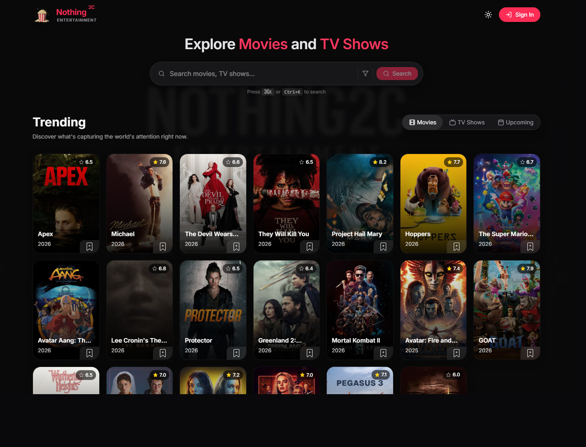

# Nothing<sup>2C</sup>

A full-stack movie and TV discovery app for building watchlists, planning movie nights with friends, and voting on what to watch together.

[Live Demo](https://nothing2c.vercel.app) | [Screenshot](./public/nothing2c-live-screenshot.png)



## Overview

Nothing<sup>2C</sup> is a social watchlist platform built with Next.js, TypeScript, Firebase, and the TMDb API. Users can discover trending movies and TV shows, save titles to a personal library, connect with friends, create shared movie-night sessions, compare availability, and vote on poll options in real time.

The app combines media discovery with lightweight social planning so a group can move from browsing options to choosing a shared watch time and title.

## Features

- Browse trending, upcoming, popular, and top-rated movies and TV shows with TMDb-powered data.
- Search across movies, series, and people with filters for type, year, genre, and sorting.
- View rich media detail pages with posters, metadata, cast, videos, recommendations, similar titles, providers, and reviews.
- Create and manage a personal watchlist synced with Firestore.
- Sign up, sign in, verify email, reset passwords, and maintain authenticated sessions with Firebase Auth.
- Send, accept, reject, and remove friend requests.
- Create watch-together sessions with selected friends, candidate dates, time slots, and optional movie or TV poll choices.
- Aggregate participant availability so the best date and time are easy to spot.
- Vote on session poll options and complete sessions when the group has decided.
- Manage account, privacy, appearance, and notification preferences.
- Support push-notification flows through Firebase Cloud Messaging.

## Tech Stack

| Area | Tools |
| --- | --- |
| Framework | Next.js App Router, React, TypeScript |
| Styling | Tailwind CSS, Radix UI, Framer Motion, Lucide React |
| Backend | Next.js Route Handlers, Firebase Admin SDK, Firebase Cloud Functions |
| Database | Cloud Firestore |
| Authentication | Firebase Authentication, session cookies |
| APIs | TMDb API, Firebase Cloud Messaging |
| Deployment | Vercel, Vercel Cron, Vercel Analytics |

## Architecture Notes

- `app/api/*` contains server routes for authentication, search, media details, users, friends, sessions, polls, notifications, and scheduled maintenance.
- `context/*` centralizes client-side state for auth, user data, watchlists, sessions, and notifications.
- `components/*` is split by product area, including discovery, media details, session planning, settings, navigation, and shared UI primitives.
- `lib/*` holds Firebase, Firebase Admin, TMDb, server-auth, and date/time helpers.
- `functions/*` contains Firebase Cloud Functions support code.
- `vercel.json` schedules a daily cron route for session maintenance.

## Getting Started

### Prerequisites

- Node.js 20 or newer
- npm
- Firebase project with Authentication and Firestore enabled
- TMDb bearer token
- Optional: Firebase Cloud Messaging VAPID key for push notifications

### Installation

```bash
git clone https://github.com/dev-kristian/afkcinema.git
cd afkcinema
npm install
```

Create a local environment file:

```bash
cp .env.local.example .env.local
```

Add your Firebase and TMDb credentials:

```bash
NEXT_PUBLIC_FIREBASE_API_KEY=
NEXT_PUBLIC_FIREBASE_AUTH_DOMAIN=
NEXT_PUBLIC_FIREBASE_PROJECT_ID=
NEXT_PUBLIC_FIREBASE_STORAGE_BUCKET=
NEXT_PUBLIC_FIREBASE_MESSAGING_SENDER_ID=
NEXT_PUBLIC_FIREBASE_APP_ID=

NEXT_PRIVATE_TMDB_API_KEY=
NEXT_PUBLIC_APP_URL=http://localhost:3000

NEXT_PUBLIC_FIREBASE_VAPID_KEY=

NEXT_PRIVATE_FIREBASE_PROJECT_ID=
NEXT_PRIVATE_FIREBASE_CLIENT_EMAIL=
NEXT_PRIVATE_FIREBASE_PRIVATE_KEY=

CRON_SECRET=
```

Run the development server:

```bash
npm run dev
```

Open [http://localhost:3000](http://localhost:3000) in your browser.

## Available Scripts

```bash
npm run dev        # Start the local Next.js development server
npm run build      # Create a production build
npm run build:full # Build Firebase functions, then build the Next.js app
npm run start      # Start the production server
npm run lint       # Run ESLint
```

Firebase functions scripts are available inside the `functions` directory:

```bash
npm --prefix functions run build
npm --prefix functions run serve
npm --prefix functions run deploy
```

## Highlights

- Next.js App Router application with typed server routes and reusable client components.
- Firebase Auth and secure session-cookie handling for authenticated pages and API routes.
- Firestore collections for users, friends, watchlists, invitations, sessions, participant availability, and poll voting.
- TMDb integration through server-side API helpers for search, discovery, media details, and recommendations.
- Realtime collaboration flows for watch-together sessions and shared decision-making.
- Responsive, theme-aware interface built with Tailwind CSS, Radix UI, and Framer Motion.
- Vercel deployment with analytics and scheduled background maintenance.

## Project Status

The core discovery, watchlist, authentication, friendship, and watch-together flows are implemented. Planned improvements include broader automated test coverage, stricter Firestore security-rule documentation, richer notification templates, and deeper social recommendations.
